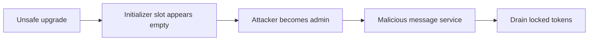

# Linea TokenBridge upgrade — permissionless reinitialization drains locks
<!-- non-defihacklabs -->
<!-- source-auditvault: https://github.com/Auditware/AuditVault/blob/main/findings/65618-after-the-upgrade-permissionless-attacker-can-fully-drain-th.md -->
<!-- date: 2026-03 -->
> **Vulnerability classes:** vuln/access-control/uninitialized-proxy · vuln/access-control/missing-auth
## Key info
| Field | Value |
|---|---|
| Loss | All locked ERC20 funds are transferred to attacker |
| Chain | Local synthetic |
## TL;DR
Replacing an inherited initializer changes the storage layout. The live bridge appears uninitialized, letting an arbitrary caller become admin, install an attacker message service, and execute `completeBridging` for all locked tokens.
## The vulnerable code
```solidity
initialized = true; // @> VULN: the changed inheritance layout makes this live bridge appear uninitialized after upgrade.
```
## Attack walkthrough
The PoC seeds 1000 tokens in the bridge, initializes it as attacker, installs a malicious message service, and drains all 1000 tokens through the messaging-only completion path.
## Diagrams

## Remediation
Preserve `Initializable` storage across upgrades, use a safe reinitializer where needed, and validate storage layout before deployment.
## Sources
- [AuditVault finding #65618](https://github.com/Auditware/AuditVault/blob/main/findings/65618-after-the-upgrade-permissionless-attacker-can-fully-drain-th.md)
- [Linea remediation `4882f33`](https://github.com/Consensys/linea-monorepo/pull/2007/commits/4882f33de707085f01e54c89d090c6fba76f33a4)
