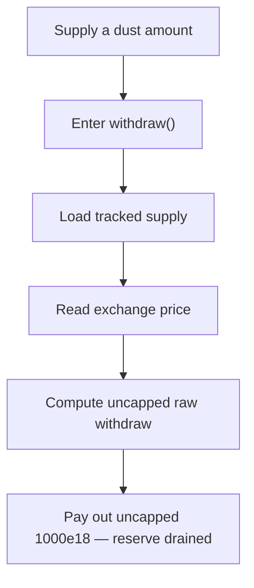

# Fluid DEX v2: `_processNormalSupplyAction` permits an uncapped withdrawal

> **Vulnerability classes:** vuln/theft · vuln/logic
>
> **Reproduction:** a faithful minimal reproduction of the vulnerable finding — the vulnerable withdraw branch of `_processNormalSupplyAction` is reproduced **verbatim** (marked `@>`) with faithful minimal doubles; local deploy, no fork.

<!-- source-auditvault: https://github.com/sherlock-audit/2026-01-fluid-dex-v2-judging/issues/610 -->

## Root cause

In [`fluid-contracts/contracts/protocols/moneyMarket/core/operateModule/helpers.sol`](https://github.com/sherlock-audit/2026-01-fluid-dex-v2/blob/main/fluid-contracts/contracts/protocols/moneyMarket/core/operateModule/helpers.sol#L459), the withdraw branch of `_processNormalSupplyAction` caps `withdrawAmountRaw_` to the user's `tokenRawSupply_` — but only for the position-storage update and health-factor check. It never re-caps `supplyAmount_`, the value it hands to `LIQUIDITY.operate` at the end of the branch. The vulnerable lines, reproduced verbatim:

```solidity
} else {
    withdrawAmountRaw_ = (((uint256(-supplyAmount_) * LC.EXCHANGE_PRICES_PRECISION) + 1) / supplyExchangePrice_) + 1; // rounded up so protocol is on the winning side
@>  if (withdrawAmountRaw_ > tokenRawSupply_) withdrawAmountRaw_ = tokenRawSupply_; // added this check for safety
}
// ...
// Give the withdraw to the user  ── supplyAmount_ is NOT capped, unlike withdrawAmountRaw_
LIQUIDITY.operate(token_, supplyAmount_, 0, to_, address(0), abi.encode(MONEY_MARKET_IDENTIFIER, NORMAL_WITHDRAW_ACTION_IDENTIFIER));
```

`withdrawAmountRaw_` (raw units, used to decrement the stored position) is clamped to what the user actually supplied, so the storage update and health factor stay consistent. But `supplyAmount_` (the token amount transferred out) is passed to `LIQUIDITY.operate` unchanged — so the protocol pays out the full requested amount regardless of the position size.

## Why it's exploitable here

Following the finding's worked example with `supplyExchangePrice = 1e12`:

1. The attacker supplies a dust amount (`1e6`). The position's `tokenRawSupply_` becomes `~999998`.
2. The attacker calls withdraw with `supplyAmount_ = -1000e18`. `withdrawAmountRaw_` is computed as a huge number and capped down to `999998` (for storage), so the position update looks fine.
3. `supplyAmount_` stays `-1000e18`. `LIQUIDITY.operate` transfers the full `1000e18` to the attacker.
4. The attacker supplied `1e6` and withdrew `1000e18` — a direct drain of honest depositors' liquidity.

## Attack path



## Marked-line walkthrough (Playground)

The EVM Playground pins each step to the exact executed source line in `0xce01759b…`:

1. **L135** — Supply a dust amount: Attacker supplies 1e6 via `supply()`, so the position's `tokenRawSupply_` becomes ~999998.
2. **L148** — Enter withdraw(): `withdraw(-1000e18, to_)` requests roughly a million times more than was supplied.
3. **L150** — Load tracked supply: Reads `tokenRawSupply_` (~999998) — the only bound the branch will enforce.
4. **L153** — Read exchange price: `_getExchangePrices` returns `supplyExchangePrice_ = 1e12`, matching the finding's worked example.
5. **L165** — Compute uncapped raw withdraw: Root cause: `withdrawAmountRaw_` is derived from 1000e18; the next line (`@>`) caps only this raw value for storage/health — `supplyAmount_` is never re-capped.
6. **L177** — Pay out uncapped supplyAmount_: `LIQUIDITY.operate` transfers the full uncapped 1000e18 to the attacker, draining honest depositors' reserve.

## PoC

Registry (Foundry, local deploy — verbatim vulnerable source + harm-asserting test):

```bash
cd 65649-fluid-processnormalsupplyaction-permits-an-uncapped-withdrawal_exp
forge test -vvv
```

The browser Playground replays the same synthetic opcode-for-opcode and measures the harm: **supply 1e6, withdraw the full uncapped 1000e18, draining the reserve**. Both gates are green (registry `forge test` PASS + Playground `_verify-poc` **VERDICT: PASS**).
